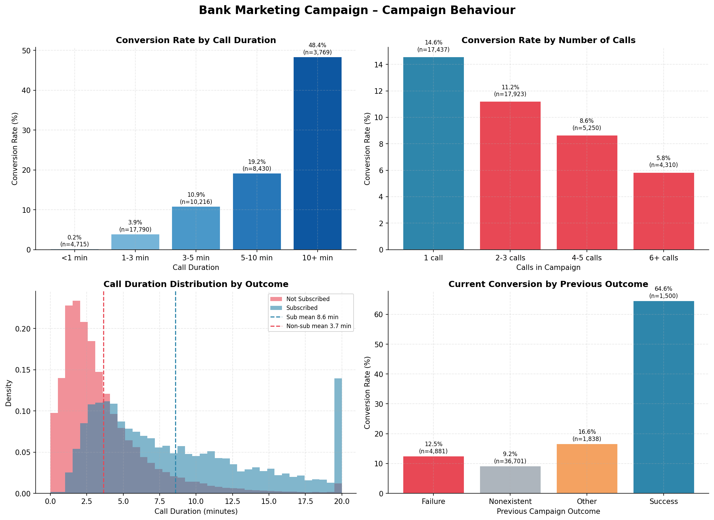
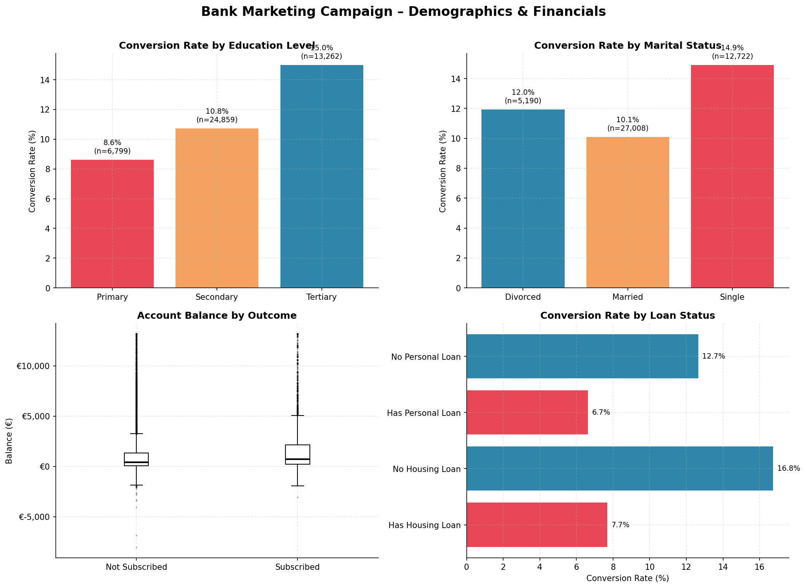
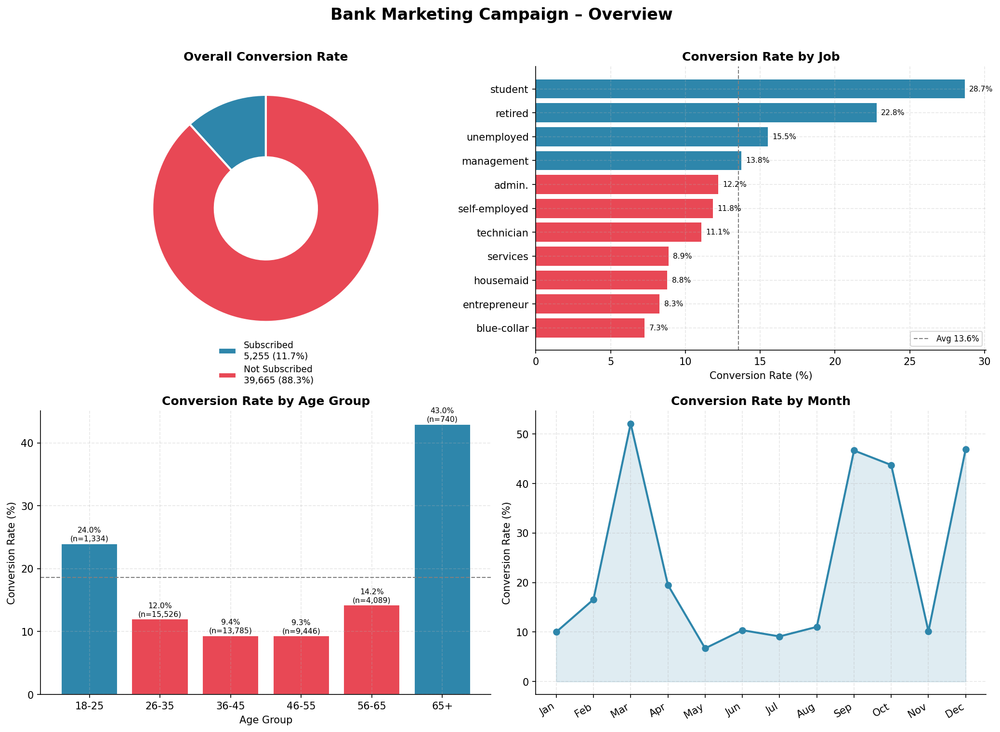

# Marketing Funnel & Conversion Performance Analysis
## Future Interns - Data Science & Analytics Task 3

### Overview 
This project analyzes a real world bank direct marketing campaign dataset
to identify conversion drop offs, channel performance, and opportunities to
improve lead to customer conversion rates.
The dataset contains 45,211 phone call records from a Portuguese banking
institution, covering campaigns run between May 2008 and November 2010.
The goal was to predict and understand which customers subscribed to a
bank term deposit after being contacted.

### Tools Used
- Python (Pandas, Matplotlib)
- VS Code

### Key Insights 
- Overall conversion rate: 11.3%
- Cellular contacts convert far better than landline
- March, September & December are the best months to call
- Calls over 3 minutes convert at 3x the average rate
- Students & retired customers are the top converting segments
- Previous successful subscribers convert at 65%+ rate

### Charts 

### Dataset
 Bank Marketing Campaign Dataset (UCI Machine Learning Repository) from Kaggle 

